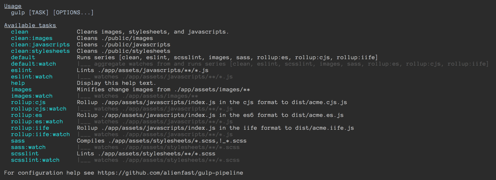

# gulp-pipeline
Gulp 4 recipes modularized as ES2015 classes. Fully configurable. Fully extensible. Full pipeline in a few lines of code.

This **is not** just for rails, it's agnostic and works for anything (node, angular, etc). 

With that said, did we mention that gulp-pipeline + [gulp-pipeline-rails](https://github.com/alienfast/gulp-pipeline-rails) enables you to remove sprockets and easily serve gulp assets with rails?

## Usage

### NPM ES2015 package sample 

This project's [`gulpfile.babel.js`](gulpfile.babel.js) serves as a reasonable npm package example, complete with build, bump version, and [publish build to a separate branch](https://github.com/alienfast/gulp-pipeline/tree/dist) and [publish to npm](https://www.npmjs.com/package/gulp-pipeline)

```javascript
import { Preset, Clean, EsLint, RollupEs, RollupAmd, RollupCjs, RollupIife, Aggregate, series, parallel } from 'gulp-pipeline'
// ES2015 tip: import your list of classes from 'gulp-pipeline/src/index' so you can inspect source as you write your file.  The line above will otherwise use the commonjs rollup dist file.

// Use a predefined preset
let preset = Preset.nodeSrc()

// Tell rollup _not_ to bundle our dependencies
let jsOverrides = {debug: false, nodeResolve: {enabled: false}, commonjs: {enabled: false}}

// NOTE: it's overkill to generate all of these, but what the hell, it's a fair example.
// Create our `default` set of recipes as a combination of series tasks with as much parallelization as possible
let recipes = series(gulp,
  new Clean(gulp, preset),
  new EsLint(gulp, preset),
  parallel(gulp,
    new RollupEs(gulp, preset, {options: {dest: 'gulp-pipeline.es.js'}}, jsOverrides),
    new RollupAmd(gulp, preset, {options: {dest: 'gulp-pipeline.amd.js'}}, jsOverrides),
    new RollupCjs(gulp, preset, {options: {dest: 'gulp-pipeline.cjs.js'}}, jsOverrides),
    new RollupUmd(gulp, preset, {options: {dest: 'gulp-pipeline.umd.js', moduleName: 'gulpPipeline'}}, jsOverrides),
    new RollupIife(gulp, preset, {options: {dest: 'gulp-pipeline.iife.js', moduleName: 'gulpPipeline'}}, jsOverrides)
  )
)

// Simple helper to create the `default` and `default:watch` tasks based on the recipes already defined, aggregating watches
new Aggregate(gulp, 'default', recipes, {debug: false})

//---------------
// Publish tasks

// prepublish gives us a quick exit, in case we didn't commit
let prepublish = new Prepublish(gulp, preset)

// publishBuild is where the magic happens, lots of good stuff here.
let publishBuild = new PublishBuild(gulp, preset)

// `publish`, gives us a `publish:watch` as well if we so desire to use it
new Aggregate(gulp, 'publish', series(gulp, prepublish, recipes))```

This configuration generates the following (call the `help` task) that is specific to the `Preset` used:

 


### Rails sample
Here's a `gulpfile.babel.js` that provides tasks to build and watch an ES2015/SCSS project.  It happens to use the Rails preset, but you can see that's a simple hash.  Simple enough?
 
```javascript
// Assuming project named: acme

import { Preset, Clean, CleanDigest, EsLint, Images, MinifyCss, Rev, Sass, ScssLint, RollupEs, RollupCjs, RollupIife, Aggregate, series, parallel } from 'gulp-pipeline'
// ES2015 tip: import your list of classes from 'gulp-pipeline/src/index' so you can inspect source as you write your file.  The line above will otherwise use the commonjs rollup dist file.

import gulp from 'gulp'

// Utilize one of the common directory structure configs
let preset = Preset.rails() // other pre-configured presets: nodeSrc, nodeLib - see preset.js and submit PRs with other common configs

// Instantiate ordered array of recipes (for each instantiation the tasks will be created e.g. sass and sass:watch)
//  Note: these are run by the run-sequence, allowing series and parallel execution
let recipes = series(gulp, 
  new Clean(gulp, preset),
  parallel(gulp, 
    new EsLint(gulp, preset),
    new ScssLint(gulp, preset)
  ),
  parallel(gulp, 
    new Images(gulp, preset),
    new Sass(gulp, preset),
    new RollupEs(gulp, preset, {options: {dest: 'acme.es.js'}}),                        // es
    new RollupCjs(gulp, preset, {options: {dest: 'acme.cjs.js'}}),                      // commonjs
    new RollupIife(gulp, preset, {options: {dest: 'acme.iife.js', moduleName: 'acme'}}) // iife self executing bundle for the browser
  )
)


// Simple helper to create the `default` and `default:watch` tasks as a series of the recipes already defined
new Aggregate(gulp, 'default', recipes)

// Create the production digest assets
let digest = [
  new CleanDigest(gulp, preset),
  new Rev(gulp, preset),
  new MinifyCss(gulp, preset)
]
new Aggregate(gulp, 'digest', digest)
```

## Recipes
- Autoprefixer
- Clean - macro with sub-variations including digest, javascripts, stylesheets, images
- Copy  - copy any source glob to destination
- EsLint
- Images - copy minified images to destination
- Jekyll - build jekyll site
- Mocha - test
- Prepublish - using [build-control](https://github.com/alienfast/build-control), check to make sure all files are committed
- PublishBuild - using [build-control](https://github.com/alienfast/build-control), bump version, build, tag, publish to git, publish to npm
- PublishNpm - using [build-control](https://github.com/alienfast/build-control), publish to npm
- Rollup (variations include amd, cjs, es, iife, umd)
- Sass
- ScssLint
- Uglify - uglify source javascripts to destination

## Aggregate
Aggregate provides a helper to not only generate a basic task from a list of series/parallel tasks e.g. `default`, but also aggregate all the watches so that separate watches do not have to be defined separately e.g. `default:watch`.  In the npm package example above and as indicated by `gulp --tasks`, `gulp default:watch` will do the folowing:

```
aggregates watches from [eslint, rollup:es, rollup:amd, rollup:cjs, rollup:umd, rollup:iife] and runs all tasks on any change
```
    
Note that unless `watch: false`, any `Aggregate` instantiation will generate the `watch` variation as well.  If you do not need the watch variation, you can just skip declaring an `Aggregate` and use `gulp.task('default', recipes)` instead, because the Aggregate provides no other real value (unless you are extending it).    
  
## Help
Generates a `help` task and dynamic help descriptions, making it easier to know the effects and if your config and presets are set properly. 
    

## Why?

### Too many different tools
The javascript community is iterating on asset tooling faster than others, indeed they own many of the tools.  In moving back and forth between node based projects and rails, we found at a minimum we were working with different configurations, and at most we were dealing with completely different or out of date tools.

Why don't we just use the same tools for the asset pipeline?  Now we can.  

### Reuse, modularity, extensibility
We are certainly not the first to consider this.  What we did see is that noone was actually reusing shared code in a way that benefits many.  We have seen people share code in a repository, but only in a way that could be cloned or copied.  We want actual reuse, in that we never want to copy code again. When we transpile ES6, we want check it with EsLint.  When we transpile SCSS, we want to check it with ScssLint...and we never want to copy that code again.  That error handling gotcha?  Don't create a gist, update and share the recipe.

## Who is this for?
**Any project** that wants gulp recipes in a reusable/extensible/modular way (node, rails, angular, etc, etc).  While we certainly want to provide recipes that can be reused and replace the conveniences of a full rails pipeline, these recipes are modular enough that any project (node, angular, etc) can utilize them.

## Error handling
Error handling is baked into the recipes and the `Base.notifyError()` sends messages to you through [`gulp-notify`](https://github.com/mikaelbr/gulp-notify) with some nice console colors, a beep, and an OS notification (if possible).

## How it works

### Recipes
Each recipe is an ES2015 class having configurable options that registers a task as well as a watch task if applicable.  These are simply common gulp build configurations.

### Common config
Each recipe depends on a common configuration for the `source` and `watch` that can be fed directly to `gulp.src`, this is the `node-glob` format with options.  Even when interfacing with other libraries that don't use `gulp.src` directly (such as rollup), these recipes use a common config for ease of use and to enable generic preset definitions.

### Preset definitions
Common preset definitions are maintained in [preset.js](src/preset.js).  These are simply common configurations for different structures found in common stacks such as node, rails, etc.  Recipes will fallback on these for configurations such as the `node-glob` `cwd`.  One example would be the `cwd` for all javascript.

### Merged configurations
Each recipe's ultimate configuration is merged with your overrides - this provides a great deal of flexibility since any configuration you provide will override the defaults.  This is all provided via the [`node-extend`](https://github.com/justmoon/node-extend#usage) library.  Familiarity with how this works should allow you to specify just about anything.

## Debugging
Initialize any recipe with `{debug: true}` and additional information can be found in the log.
                                                                                     
## I want it to work different...what can I do?

There are many things you can do here (not an exhaustive list):

1. Configure the options which are passed into the recipe that is instantiated.

1. Extend the class and customize it to your liking

1. Extend the `BaseRecipe` class to create your own recipe

1. Create your own gulp task and simpy `#run` the recipe without registering tasks:
  ```javascript
  gulp.task('foo', () => {
    // do stuff
  
    // run the recipe
    new Sass(gulp, {task: false, watch: false}).run()
    
    // do other stuff
  })
  ```
1. Submit a PR to change the existing recipe to a better one!


## You don't have a recipe that does ______
Submit a PR and we'll include it!

## My directory structure doesn't fit the pattern
No problem, just start with the `#baseline` and add your overrides such as the following:

  ```javascript
  let preset = Preset.baseline({
    javascripts: {
      source: { options: {cwd: 'js/src'}},
      watch: {options: {cwd: 'js/src'}},
      test: {options: {cwd: 'js/tests'}}
    },
    stylesheets: {
      source: {options: {cwd: 'scss'}},
      watch: {options: {cwd: 'scss'}}
    },
    images: {
      source: {options: {cwd: 'images'}},
      watch: {options: {cwd: 'images'}}
    }
  })
  ```

## Credits
> If I have seen further, it is by standing on the shoulders of giants. - Sir Isaac Newton
  
- VigetLabs for their blog post _[Gulp on Rails: Replacing the Asset Pipeline](https://viget.com/extend/gulp-rails-asset-pipeline)_ and [gulp-rails-pipeline starter project](https://github.com/vigetlabs/gulp-rails-pipeline)
- Argency for their blog post _[Gulp - a modern approach to asset pipeline for Rails developers](http://blog.arkency.com/2015/03/gulp-modern-approach-to-asset-pipeline-for-rails-developers/)_ 
- Bugsnag for their blog post _[Replacing the Rails asset pipeline with Gulp: Using Gulp to compile and cache our assets](http://blog.bugsnag.com/replacing-the-rails-asset-pipeline-with-gulp)_
